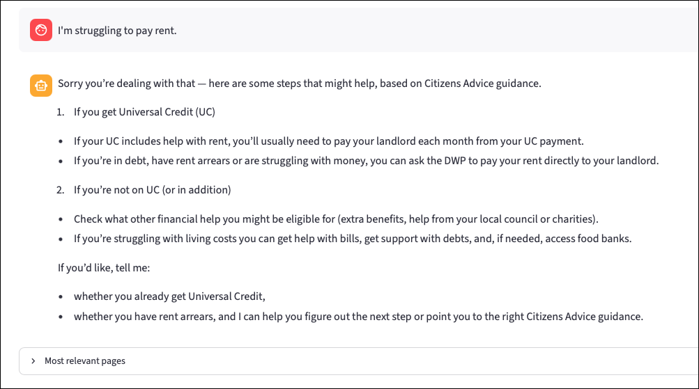
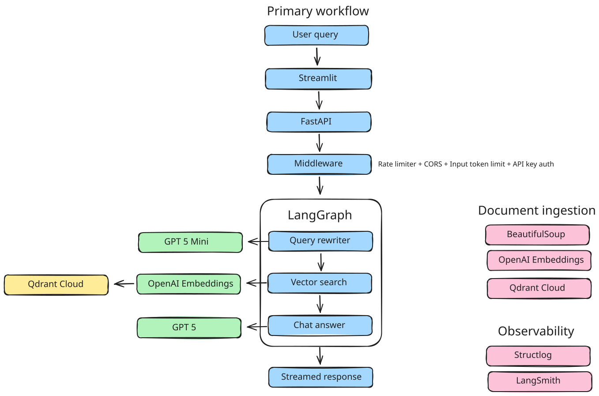

# Support Navigator

AI-powered welfare support chatbot using LangGraph, FastAPI, BeautifulSoup, Qdrant, OpenAI, and LangSmith.

## Try it out

**🔗 Live demo:** https://support-navigator.streamlit.app

Notes:
- The LLM budget is currently limited, so please be considerate when using the app :)
- Both the frontend and backend shut down after inactivity. You may need to "wake up" the Streamlit frontend, and the first request may take a few minutes to respond. After that, latency is typically 10-15 seconds per request.

## Project architecture



## Run it locally

### Prerequisites

- Python 3.13
- An OpenAI API key (`OPENAI_API_KEY`)
- A running Qdrant instance (default: `http://localhost:6333`)

### Install

```bash
python -m venv .venv
source .venv/bin/activate
pip install -r requirements.txt
```

### Configure environment

Copy `.env.example` to `.env` and fill in the values:

```bash
cp .env.example .env
```

For the shared API key, set a value that both the API and Streamlit app can read:

```bash
API_SHARED_KEY=replace-with-a-long-random-value
```

### Run the API

```bash
uvicorn api:app --host 0.0.0.0 --port 8000 --reload
```

Optional health check:

```bash
curl http://localhost:8000/health
```

### Run Streamlit

In a second terminal (same virtual environment):

```bash
streamlit run streamlit_app.py
```

Open the Streamlit URL shown in the terminal (usually `http://localhost:8501`).
